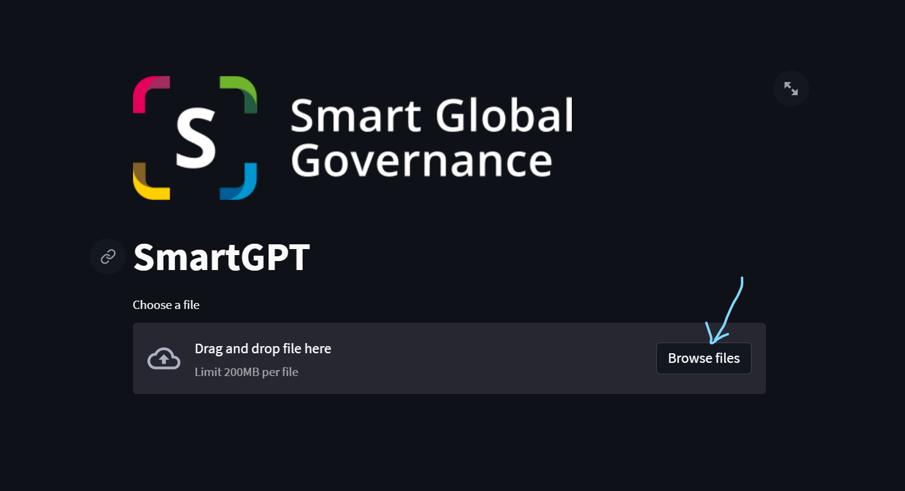
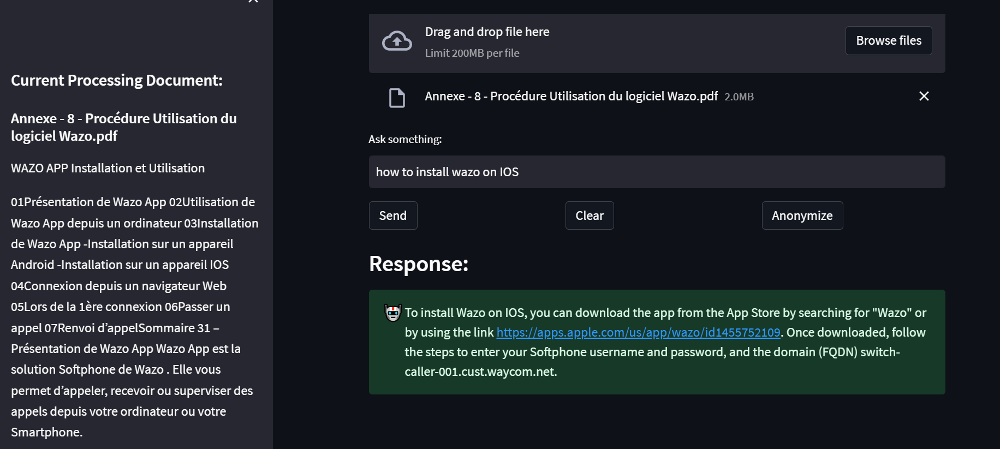

# SmartGPT
## Introduction
#

SmartGPT est un outil d'assistance issue d'OpenAI qui permet de déposer des documents pour ensuite pouvoir poser des questions sur ceux-ci
#
## Utilisation
#
> ⚠️**Attention**: **L'Utilisation de cette plateforme utilise une clé d'API OpenAI donc chaque requète est Payante**

L'utilisation de cette intérface est très simple il suffit de déposer vos fichiers ici

##

ensuite il suffit de poser des questions sur le(s) document(s) téléchargé(s) comme cela

